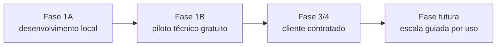
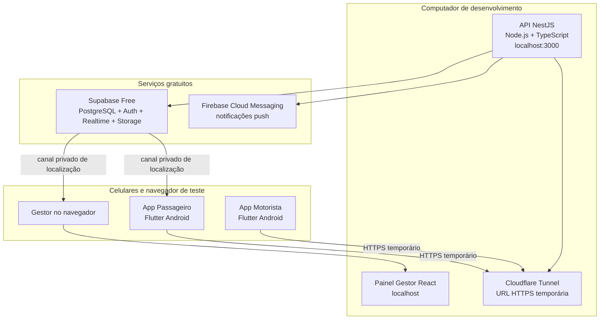
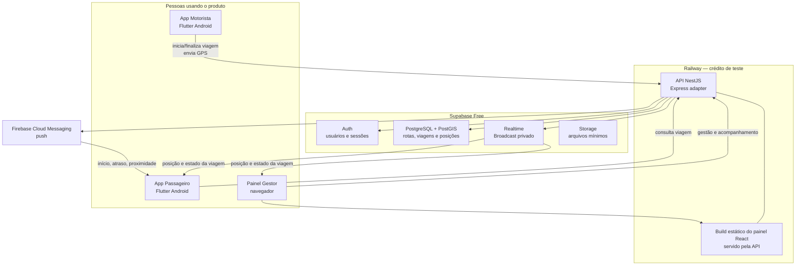
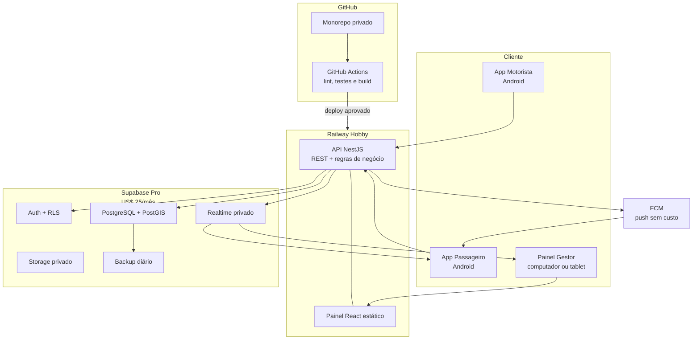
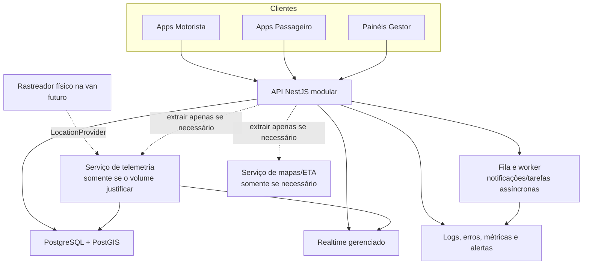
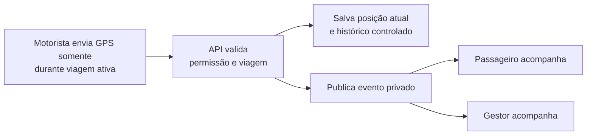

# Rotas Inteligentes — Arquitetura por fases

Este documento mostra a evolução da arquitetura. A regra é simples: começar com a menor infraestrutura que permite testar uma viagem real e adicionar componentes somente quando houver contrato, uso ou necessidade comprovada.

## Visão geral

## Fase 1A — Desenvolvimento local

**Objetivo:** aprender NestJS, criar a primeira API e testar integração entre aplicativo, API e Supabase sem custo de hospedagem.

### Limites desta fase

- O computador precisa estar ligado para a API funcionar.
- A URL do tunnel é temporária; não deve ser usada em uma viagem real.
- Não existe promessa de disponibilidade nem backup automático.

## Fase 1B — Piloto técnico gratuito

**Objetivo:** realizar as primeiras viagens reais com até 2 vans, 35 passageiros e 2 rotas. Validar GPS com celular bloqueado, atualização privada, internet instável e uso real.

### Regras do piloto

- A localização só é enviada com uma viagem ativa.
- A API valida motorista, organização e viagem antes de aceitar uma posição.
- Passageiros e gestor só recebem eventos da rota/organização à qual pertencem.
- O painel e a API são projetos separados no monorepo, mas são entregues juntos no Railway para não criar custo extra.
- Enquanto não houver contrato, o Supabase Free e o crédito inicial do Railway são suficientes para teste, mas não devem ser tratados como produção comercial.

## Fase 3/4 — Cliente contratado

**Objetivo:** operar como serviço pago com uma base mínima de confiabilidade, custo conhecido e deploy controlado.

### O que muda após o contrato

- Supabase Pro: projeto não fica sujeito à pausa por inatividade e passa a ter backup diário.
- Railway Hobby: API fica disponível continuamente como ambiente do produto.
- GitHub Actions começa a bloquear Pull Requests com falha e faz deploy somente após aprovação.
- Orçamento de infraestrutura inicial: aproximadamente **US$ 30/mês**, sem incluir domínio, mapas e impostos/câmbio.

## Fase futura — Escala orientada por evidência

**Objetivo:** evoluir apenas os pontos que comprovadamente precisarem de mais capacidade. Esta não é a arquitetura do MVP.

### Gatilhos para extrair um serviço

| Sinal observado | Possível evolução |
|---|---|
| Grande volume de posições GPS ou retenção longa de histórico | Extrair processamento de telemetria e introduzir fila. |
| Muitas notificações e tarefas assíncronas | Criar worker separado. |
| Cálculo de ETA/rotas torna-se pesado | Isolar serviço de mapas e roteamento. |
| Muitos clientes, regiões ou exigências corporativas | Rever hospedagem, isolamento por cliente e banco. |

## O que permanece igual em todas as fases

O ponto central não muda: a API controla regra de negócio e acesso; o Supabase guarda dados e entrega eventos em tempo real; aplicações mostram apenas os dados aos quais cada pessoa tem permissão.

