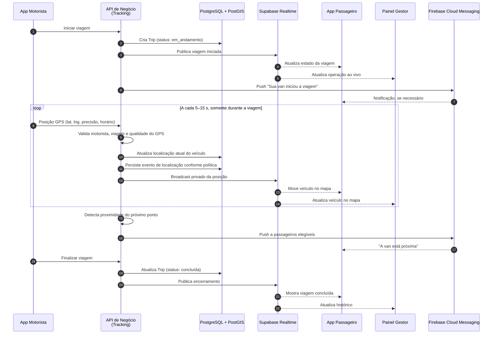

# Fase 1 — Proposta de arquitetura e backend

**Status:** proposta técnica para decisão  
**Produto inicial:** vans universitárias privadas, recorrentes  
**Objetivo:** sustentar um piloto real com localização ao vivo, permissões por papel e operação de uma pequena frota, sem criar complexidade que ainda não será usada.

## 1. Decisão arquitetural

### Decisão

Construir o MVP com um **monólito modular em TypeScript**, exposto por uma API HTTP sem estado, e usar serviços gerenciados para dados, autenticação, tempo real, notificações e mapas.

Isso significa que haverá **um único backend de negócio**, mas o código terá módulos independentes e fronteiras claras. Não significa colocar tudo em um arquivo ou misturar responsabilidades.

```text
Aplicativos e painel → API de negócio → banco / tempo real / notificações / mapas
```

### Por que não microserviços agora

Para o primeiro piloto teremos uma van, uma rota e poucas dezenas de pessoas. Microserviços exigiriam, desde o primeiro dia:

- comunicação e autenticação entre serviços;
- filas, observabilidade e deploy independente para cada serviço;
- tratamento de falhas distribuídas;
- mais repositórios, variáveis de ambiente e custo operacional.

Eles não melhoram o rastreamento em si. O risco real do piloto é GPS em segundo plano, bateria, internet e adesão de motorista e passageiros — não capacidade de atender milhões de requisições.

O caminho correto é criar módulos que **podem** ser extraídos no futuro, apenas se houver evidência: grande volume de posições, necessidade de processamento pesado de rotas ou equipes independentes.

## 2. Arquitetura recomendada

### Organização do código

**Decisão:** um monorepo com as quatro aplicações independentes. Cada app terá build, testes, versão e pipeline próprios; mudanças serão entregues por Pull Request e CI por caminho. O monorepo poderá ser dividido em repositórios no futuro, caso apareçam times, permissões ou ciclos de entrega realmente independentes.

```text
rotas-inteligentes/
├── apps/
│   ├── motorista/
│   ├── passageiro/
│   ├── gestor-web/
│   └── api/
├── packages/
│   └── shared-contracts/
├── docs/
└── .github/workflows/
```

### Canais de produto

1. **Aplicativo Motorista** — inicia/finaliza a viagem e envia a posição.
2. **Aplicativo Passageiro** — acompanha a viagem, localização, estado e avisos.
3. **Painel do gestor (web responsivo)** — funciona em computador e tablet; configura operação, veículos, rotas, pontos, alunos e acompanha viagens.

O painel será o centro de onboarding, configuração, segurança e monitoramento. A criação de rotas ficará no painel, inclusive em uma visualização responsiva para uso no celular durante o piloto. O aplicativo do motorista receberá viagens já configuradas e não criará rotas no MVP.

Os dois aplicativos serão distribuídos separadamente, mas devem nascer do **mesmo monorepo e da mesma base Flutter**, compartilhando design system, autenticação, cliente de API e regras comuns. Cada app preserva uma experiência e permissões próprias.

### Stack-base proposta

| Camada | Decisão para o MVP | Papel |
|---|---|---|
| Apps móveis | Flutter / Dart, dois builds | Android primeiro; caminho aberto para iOS sem reescrever o produto. |
| Painel gestor | React + TypeScript, preferencialmente Next.js | Painel administrativo responsivo para desktop/tablet. |
| API de negócio | Node.js + TypeScript + NestJS com adaptador Express | Regras de domínio, autorização, ingestão de localização e integrações; base familiar para aprender a arquitetura do NestJS. |
| Banco, autenticação, realtime e arquivos | Supabase: PostgreSQL, Auth, Realtime e Storage | Reduz infraestrutura inicial sem abrir mão de SQL e políticas de acesso. |
| Geoespacial | PostgreSQL + PostGIS | Pontos, rotas, proximidade e consultas geográficas. |
| Push | Firebase Cloud Messaging (FCM) | Notificações Android e, depois, iOS via APNs. |
| Mapas e geocodificação | Google Maps Platform como hipótese inicial | Mapa no app, geocodificação e, quando necessário, rotas/ETA. Avaliar custo no piloto. |
| Hospedagem web/API | Vercel para painel; API containerizada em Railway, Render, Fly.io ou AWS App Runner | Separar front-end de API e evitar depender de uma função WebSocket própria. |

> Decisão de aprendizado: Fastify será explorado em uma prova técnica curta e comparado ao adaptador Express do NestJS. Ele não será introduzido no MVP por otimização prematura; a mudança só ocorrerá se a equipe entender seus ganhos e preferir conscientemente o adaptador.

O Supabase é adequado para este estágio porque junta PostgreSQL, autenticação, armazenamento, políticas de acesso e canal de tempo real. Para atualizações em tempo real, a própria documentação recomenda Broadcast como abordagem mais escalável e segura; as mudanças diretas do banco são mais simples, mas escalam pior. [Supabase Realtime](https://supabase.com/docs/guides/realtime/subscribing-to-database-changes)

As Vercel Functions atendem bem APIs HTTP sem estado, mas não atuam como servidor WebSocket. Por isso, usar Supabase Realtime elimina essa limitação sem manter um servidor de sockets próprio. [Limites das Vercel Functions](https://vercel.com/docs/limits)

## 3. Node.js, NestJS, Express, Fastify ou C#?

**Node.js com TypeScript e NestJS é a escolha inicial. O NestJS começará com Express; Fastify será estudado em paralelo e C# não entra porque “o sistema ficou pesado”.**

Node é perfeitamente capaz de receber posições, validar permissões, gravar no banco, disparar eventos e notificações. Esse fluxo é predominantemente I/O: recebe uma requisição, consulta/grava dados e retorna. A vantagem aqui é velocidade de entrega, uma linguagem comum entre painel e backend e aderência ao repertório atual.

O NestJS foi escolhido não apenas pela estrutura do produto, mas como aprendizado técnico intencional: módulos, controllers, services, injeção de dependência, guards, validação e testes. Começar com Express reduz a curva inicial para quem já conhece Node/Express. Em seguida, a mesma API de estudo poderá ser executada com Fastify para entender suas diferenças sem transferir risco para o MVP.

C# faz sentido mais adiante se ocorrer uma destas condições:

- equipe já domina .NET e a produtividade passa a ser maior nele;
- existem integrações corporativas fortes ou exigências de cliente enterprise;
- há processamento contínuo e intensivo: otimização de rotas complexa, telemetria em alto volume, relatórios pesados;
- um serviço específico precisa de desempenho/concorrência muito previsível e merece ser isolado.

Mesmo nesses cenários, a primeira evolução seria extrair **um** serviço específico (por exemplo, processamento de telemetria), não reescrever toda a aplicação em C#.

## 4. Módulos internos do backend

```text
apps/api
├── identity        autenticação, usuários, organizações e papéis
├── fleet           veículos, motoristas e vínculos
├── routes          rotas recorrentes, pontos e alunos vinculados
├── trips           instâncias de viagem e sua máquina de estados
├── tracking        recebimento, validação e publicação de GPS
├── notifications   tokens de dispositivo e envios push
├── maps            geocodificação, distância e ETA
├── invitations     convites e ativação de passageiros
└── audit           registro de ações importantes
```

Cada módulo terá casos de uso e contrato próprios. Nenhum módulo acessa tabelas alheias diretamente sem uma interface definida. Assim, `tracking` poderá se tornar um serviço separado se e quando a telemetria justificar.

## 5. Fluxo de uma viagem ao vivo



### Regras importantes desse fluxo

- O aplicativo do motorista só envia GPS com uma viagem ativa; não haverá rastreamento permanente.
- O app não deve enviar uma posição a cada segundo. Começaremos em **5–15 segundos**, com ajuste por movimento, precisão e bateria durante a prova técnica.
- `vehicle_live_location` guarda apenas a última posição de cada veículo para consulta rápida.
- `location_event` guarda histórico de forma limitada e com retenção definida. Para o piloto, não precisamos armazenar todos os pontos indefinidamente.
- Passageiro e gestor só entram em canal privado de uma viagem/organização à qual pertencem. Sem canais públicos de localização.
- Se a última posição passar do limite definido (por exemplo, 60 s), a interface deve exibir “sinal desatualizado”, e não fingir que a van continua em movimento.

## 6. Modelo de dados inicial

| Entidade | Finalidade |
|---|---|
| `organization` | Cliente/operador da van. É o limite principal de dados (tenant). |
| `user_profile` | Perfil da conta autenticada. |
| `organization_member` | Vínculo de pessoa e organização: proprietário, gestor, motorista ou passageiro. |
| `vehicle` | Van cadastrada, placa, identificação e estado. |
| `driver_assignment` | Motorista autorizado a conduzir determinado veículo/rota. |
| `route` | Rota recorrente da operação. |
| `route_stop` | Pontos ordenados da rota, coordenadas e horários estimados. |
| `passenger_enrollment` | Passageiro vinculado a uma rota. |
| `trip` | Execução concreta de uma rota em uma data/horário. |
| `trip_event` | Início, atraso, incidente, cancelamento e fim da viagem. |
| `vehicle_live_location` | Última posição conhecida por veículo/viagem. |
| `location_event` | Histórico controlado de posições durante uma viagem. |
| `device_push_token` | Token FCM por dispositivo. |
| `invitation` | Convite para um passageiro ou colaborador entrar na organização. |
| `audit_log` | Ações administrativas relevantes. |

### Estados de viagem

```text
agendada → disponível → iniciada → em_andamento → atrasada → concluída
                                         └──────────────→ cancelada
```

`atrasada` é um estado operacional sinalizado pelo motorista ou pelo gestor; não deve impedir o envio de localização.

## 7. Permissões e segurança

| Papel | Pode fazer |
|---|---|
| Proprietário | Tudo na própria organização, inclusive gestores e cobrança futura. |
| Gestor | Veículos, motoristas, rotas, alunos, convites e acompanhamento. |
| Motorista | Ver apenas rotas/viagens autorizadas; iniciar/finalizar viagem e transmitir posição. |
| Passageiro | Ver somente suas rotas e viagens; acompanhar a localização permitida. |

Autenticação: Supabase Auth com e-mail e senha no piloto. O backend validará o JWT em todas as chamadas. As tabelas terão Row Level Security (RLS), e a API continuará aplicando regras de domínio; RLS é uma segunda barreira, não substituto das regras da aplicação.

## 8. Ponto de decisão: Postgres ou DynamoDB

**Recomendação: PostgreSQL com PostGIS. Não DynamoDB para o MVP.**

O produto é relacional: organização, membros, rotas, pontos, veículos, viagens e permissões. PostgreSQL lida bem com esse conjunto e PostGIS permite consultas de proximidade e dados geográficos. DynamoDB pode ser excelente para altíssimo volume e chaves de acesso muito previsíveis, mas aumentaria a dificuldade de modelar relações, consultas administrativas e relatórios nesta fase.

Neon seria uma boa escolha se quisermos apenas PostgreSQL gerenciado. Porém, se a equipe adotar Supabase para Auth, Realtime e Storage, usar seu PostgreSQL reduz integrações e pontos de falha. O Postgres do Neon suporta extensões, mas a confirmação de extensões e região entra na comparação de custo da Fase 1. [Compatibilidade do Neon](https://neon.com/docs/reference/compatibility)

## 9. Serviços externos e limites

### Geolocalização e mapas

- **Origem do GPS:** sensor do aparelho Android do motorista no piloto.
- **Fonte futura:** criar uma interface `LocationProvider`; assim, depois poderemos aceitar rastreador físico instalado na van sem reescrever o domínio.
- **Mapa/geocodificação:** Google Maps Platform como hipótese inicial. A prova técnica deve validar SDK Flutter, chave restrita por aplicativo, geocodificação e custos reais de uso.
- **Não fazer no MVP:** cálculo próprio de rota, otimização automática, trânsito avançado ou ETA “perfeito”.

### Push

Firebase Cloud Messaging é multiplataforma, podendo enviar a um dispositivo, grupo ou tópico; o backend será o ambiente confiável que decide quem recebe cada aviso. [Documentação do FCM](https://firebase.google.com/docs/cloud-messaging)

Eventos iniciais: viagem iniciada, atraso relevante, van próxima ao ponto, viagem cancelada e viagem concluída. “Pop-up” dentro do app é um estado de interface; quando o app estiver fechado, usamos push.

### Arquivos

No MVP: apenas avatar opcional e, se necessário, fotos/documentos administrativos. Usar Supabase Storage com URLs privadas e regras por organização. Não permitir upload livre de arquivos de passageiros.

## 10. Hospedagem e evolução

### Piloto

```text
Vercel               → painel gestor React/Next.js
Serviço Node Docker  → API NestJS/Fastify
Supabase             → Postgres, PostGIS, Auth, Realtime e Storage
Firebase             → push
Google Maps          → mapa/geocodificação
```

O serviço Node pode iniciar em um provedor simples de container. Se houver requisito de concentrar tudo na AWS, a evolução natural é API em App Runner ou ECS Fargate, banco em RDS PostgreSQL e serviços específicos AWS. Essa migração não é pré-requisito para validar o piloto.

### Quando extrair serviços

| Sinal observado | Evolução possível |
|---|---|
| Muitas posições por segundo / retenção extensa | Extrair `tracking`, usar fila e armazenamento de telemetria apropriado. |
| Notificações e regras assíncronas crescendo | Worker/fila separado. |
| Cálculo de rota/ETA pesado | Serviço `maps/routing` isolado, eventualmente em C#. |
| Muitos clientes e isolamento exigente | Banco/recursos por tenant ou arquitetura multi-tenant mais avançada. |

## 11. Entregáveis técnicos da Fase 1

1. Documento de decisões (ADRs): monólito modular, stack, tenancy, GPS e tempo real.
2. Diagrama de arquitetura e fluxo de viagem ao vivo (este documento inicia ambos).
3. Modelo ER completo com chaves, índices, RLS e política de retenção de localização.
4. Contrato de API v1: autenticação, organização, rotas, viagens, GPS, convites e notificações.
5. Prova técnica Android: iniciar viagem, GPS em segundo plano, app passageiro/painel recebendo posição privada e sinal desatualizado.
6. Teste de consumo de bateria, comportamento sem internet e retomada do app do motorista.
7. Matriz de custos para piloto e para 10/50/100 vans.
8. Ambiente de desenvolvimento, homologação e produção, com variáveis de ambiente separadas.
9. CI básico: lint, testes, build e deploy de homologação a cada pull request.
10. Observabilidade mínima desde o MVP: logs estruturados, rastreio de erro e alertas para falha na ingestão de GPS.

## 12. Critérios para encerrar a Fase 1

- O time aprovou as decisões de stack e hospedagem.
- Existe um repositório organizado e um ambiente de homologação acessível.
- O modelo de dados, permissões e contrato da API estão revisados.
- A prova de GPS funciona com o telefone bloqueado durante uma viagem simulada, registra uma posição recente e atualiza passageiro/painel em canal privado.
- Uma perda temporária de internet não encerra a viagem nem corrompe dados; o app informa o problema e retoma o envio.
- O custo estimado é aceitável para o piloto e tem alertas de orçamento configuráveis.

## 13. Decisões ainda pendentes

1. Android somente no piloto ou Android e iOS na primeira publicação?
2. Hospedagem da API: provedor de container simples inicialmente ou AWS App Runner desde o começo?
3. Google Maps Platform ou Mapbox após comparar custo e experiência da prova técnica?
4. Intervalo final de GPS e retenção do histórico de posições.
5. Duração do piloto e faixa de preço após o piloto.
