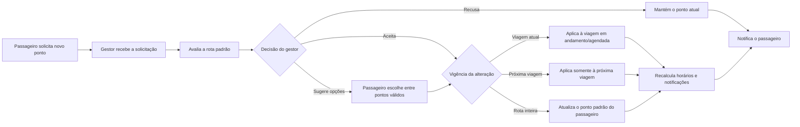
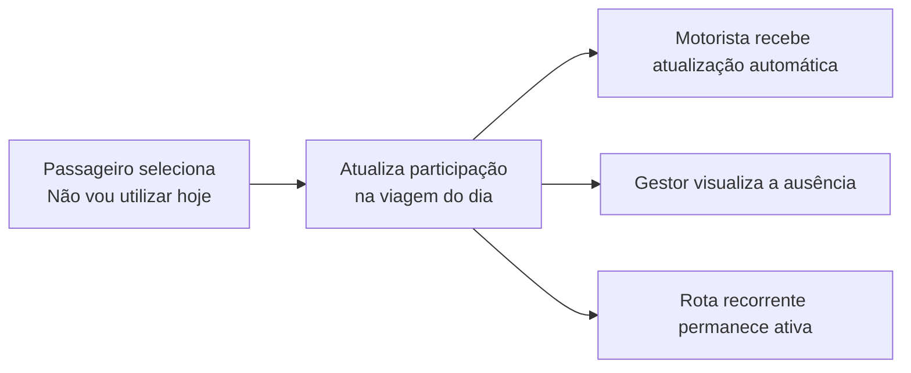
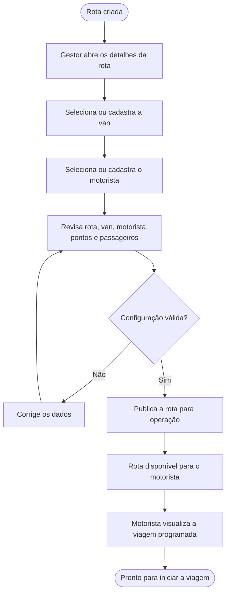
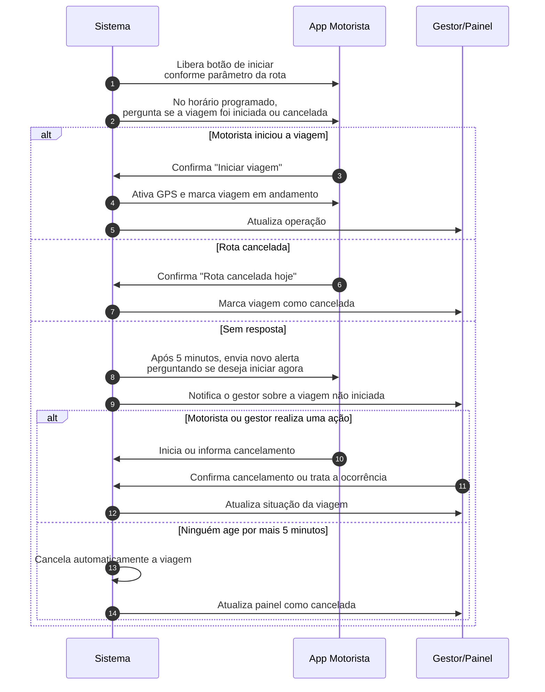
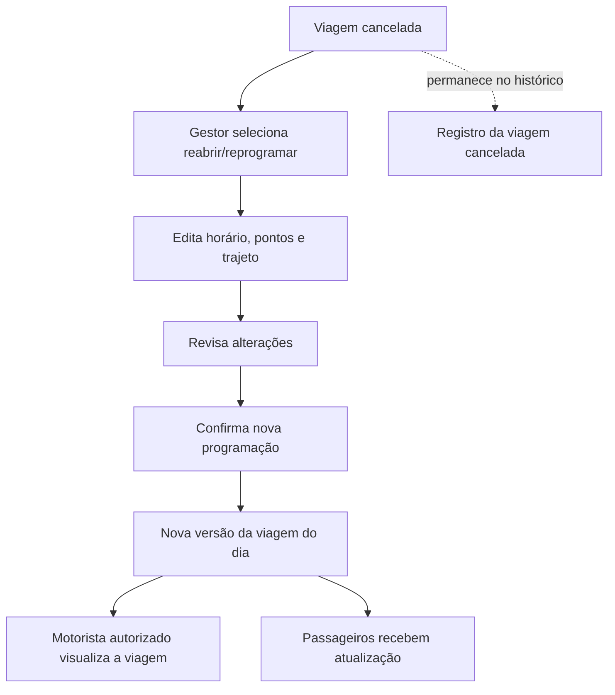

# Rotas Inteligentes — Fluxos funcionais do MVP

Este documento registra os fluxos principais do produto antes da implementação. O primeiro fluxo descreve o **Dia 0**, quando o gestor recebe acesso e configura a primeira operação.

## Fluxo consolidado — operação completa

```mermaid
flowchart TD
    A([Gestor recebe acesso]) --> B["Acessa painel gestor"]
    B --> C{"Contratou suporte?"}
    C -->|Sim| D["Equipe auxilia onboarding"]
    C -->|Não| E["Gestor realiza onboarding"]
    D --> F["Criar organização e rota"]
    E --> F

    F --> G["Cadastrar nome, horários,<br/>origem e pontos"]
    G --> H["Vincular passageiros<br/>aos pontos"]
    H --> I["Configurar notificações<br/>e margem padrão de 3 minutos"]
    I --> J["Vincular van e motorista"]
    J --> K["Publicar rota"]

    K --> L["Viagem aparece automaticamente<br/>no app do motorista"]
    L --> M["Botão liberar 15 minutos antes<br/>(parâmetro editável)"]
    M --> N{"Motorista iniciou?"}

    N -->|Sim| O["Inicia viagem"]
    N -->|Não no horário| P["Alerta inicial ao motorista"]
    P --> Q["Após 5 minutos:<br/>novo alerta + painel notificado"]
    Q --> R{"Alguém realizou ação?"}
    R -->|Motorista inicia| O
    R -->|Gestor trata| S["Gestor cancela ou reprograma"]
    R -->|Ninguém por mais 5 minutos| T["Cancela viagem do dia"]

    S --> U{"Reprogramou?"}
    U -->|Sim| V["Altera horário, pontos ou trajeto"]
    U -->|Não| T
    V --> W["Notifica passageiros e motorista"]
    W --> O
    T --> X{"Gestor reabre?"}
    X -->|Sim| V
    X -->|Não| HISTORY["Registra cancelamento no histórico"]

    O --> GPS["Ativa GPS e Realtime"]
    GPS --> START_NOTIFY["Notifica passageiros ativos<br/>e abre mapa/link privado"]
    START_NOTIFY --> ACTIVE["Passageiros acompanham a van"]

    ACTIVE --> ABSENCE{"Passageiro marcou<br/>Não vou utilizar hoje?"}
    ABSENCE -->|Sim| ABS["Remove passageiro da viagem<br/>e cancela notificações"]
    ABS --> SKIP{"Ponto ficou sem passageiros?"}
    SKIP -->|Sim| SKIP_STOP["Pula ponto na viagem do dia"]
    SKIP -->|Não| NEXT
    SKIP_STOP --> NEXT
    ABSENCE -->|Não| NEXT["Segue rota operacional"]

    NEXT --> NEAR["Van passa pelos pontos"]
    NEAR --> POINT["Ponto atendido desaparece<br/>e próximo ponto é destacado"]
    POINT --> ALERTS["Aviso por horário e/ou 500 metros<br/>uma vez por viagem"]
    ALERTS --> DEST["Destino aproximado e horário estimado"]

    DEST --> GEO{"Van dentro de 100m<br/>por 1 minuto?"}
    GEO -->|Não| GPS
    GEO -->|Sim| COMPLETE["Encerra GPS e conclui viagem"]
    COMPLETE --> END_NOTIFY["Notifica passageiros ativos<br/>e atualiza painel"]
    END_NOTIFY --> HIST["Salva resumo e histórico"]
    HIST --> PASS_H["Passageiro: histórico próprio"]
    HIST --> DRIVER_H["Motorista: viagens realizadas"]
    HIST --> MANAGER_H["Gestor: operação completa"]
```



## Dia 0 — Onboarding e criação da primeira rota

```mermaid
flowchart TD
    START([Gestor recebe acesso ao onboarding]) --> ACCESS["Acessa o painel gestor"]
    ACCESS --> SUPPORT{"Gestor contratou<br/>suporte de onboarding?"}

    SUPPORT -->|Sim| ASSIST["Equipe Rotas Inteligentes<br/>apoia ou realiza a configuração"]
    SUPPORT -->|Não| HOME["Gestor acessa a tela inicial"]

    ASSIST --> REVIEW["Gestor revisa e confirma<br/>os dados da operação"]
    HOME --> CREATE["Clica em<br/>Iniciar cadastro de rota"]
    REVIEW --> CREATE

    CREATE --> ROUTE_NAME["Informa o nome da rota"]
    ROUTE_NAME --> DEPARTURE["Informa o horário<br/>de saída"]
    DEPARTURE --> ARRIVAL["Informa o horário estimado<br/>de chegada ao destino"]
    ARRIVAL --> ORIGIN["Cadastra o ponto de início<br/>da rota"]

    ORIGIN --> STOP_QTY["Informa a quantidade estimada<br/>de pontos de parada"]
    STOP_QTY --> STOP["Cadastra um ponto de parada"]

    STOP --> STOP_DATA["Define localização,<br/>horário estimado de chegada<br/>e horário estimado de saída"]
    STOP_DATA --> PASSENGER["Vincula passageiro ao ponto"]
    PASSENGER --> PERSON_DATA["Informa nome e telefone"]
    PERSON_DATA --> ALERT{"Deseja configurar<br/>aviso de proximidade?"}

    ALERT -->|Sim| ALERT_TIME["Escolhe antecedência:<br/>5 minutos ou distância em metros"]
    ALERT -->|Não| MORE{"Existem mais pontos?"}
    ALERT_TIME --> MORE

    MORE -->|Sim| STOP
    MORE -->|Não| REVIEW_ROUTE["Revisa rota, horários,<br/>pontos e passageiros"]
    REVIEW_ROUTE --> VALIDATE{"Dados válidos?"}

    VALIDATE -->|Não| FIX["Corrige os dados indicados"]
    FIX --> REVIEW_ROUTE
    VALIDATE -->|Sim| SAVE["Salva a primeira rota"]
    SAVE --> SUCCESS([Primeira rota criada])
```



## Regras funcionais do Dia 0

### Acesso e onboarding

- O gestor recebe acesso individual ao painel.
- A senha inicial pode ser temporária e deve ser alterada no primeiro acesso.
- O suporte de onboarding é opcional e poderá ser comercializado como serviço adicional.
- Mesmo quando o suporte fizer o cadastro, o gestor deve conseguir revisar e confirmar os dados.

### Cadastro da rota

- O gestor informa um nome que permita reconhecer a rota.
- A rota possui horário de saída e horário estimado de chegada ao destino.
- O ponto de início é obrigatório.
- A quantidade de paradas pode ser usada apenas para orientar o cadastro; o sistema deve considerar como fonte real a lista de pontos efetivamente cadastrados.
- Cada ponto precisa ter localização e ordem na rota.
- Cada ponto pode ter horário estimado de chegada e saída.

### Passageiros

- Um passageiro pode ser vinculado a um ponto específico da rota.
- Cada passageiro recebe dois horários referentes ao seu ponto de embarque: chegada estimada da van e horário recomendado para estar pronto.
- O passageiro poderá solicitar alteração do ponto de embarque pelo aplicativo.
- A solicitação não altera a rota automaticamente.
- O gestor avalia a solicitação conforme a rota padrão e decide se aceita, recusa ou apresenta opções de pontos válidos.
- Se aprovada para a rota, a mudança passa a ser o ponto padrão do passageiro.
- O gestor pode escolher aplicar a mudança somente a uma viagem específica, criando uma exceção temporária.
- Se a mudança valer para a viagem atual, o motorista receberá a atualização imediatamente no aplicativo.
- O passageiro também receberá a confirmação e os horários recalculados.
- O passageiro poderá marcar "Não vou utilizar hoje" para a viagem do dia.
- Essa ação altera somente a participação do passageiro na viagem atual; a rota recorrente permanece ativa.
- A ausência será atualizada automaticamente para o motorista e para o gestor.
- O prazo padrão para informar a ausência será de 1 hora antes da viagem.
- Esse prazo será um parâmetro editável pelo gestor na configuração da operação/rota.
- Após o registro da ausência, o passageiro desaparece automaticamente da visualização operacional do motorista naquela viagem.
- O ponto de parada só será ocultado do mapa operacional se não houver outro passageiro ativo vinculado a ele.
- O ponto permanece na configuração da rota e no histórico, pois continua fazendo parte da rota recorrente.
- Se um ponto ficar sem passageiros ativos, a rota operacional daquele dia será recalculada para pulá-lo.
- O recálculo vale somente para a viagem do dia e não altera a rota recorrente.
- As notificações daquela viagem serão canceladas para o passageiro ausente.
- No MVP, os dados mínimos são nome e telefone.
- Um passageiro pode ser vinculado a apenas um ponto na primeira versão, mas o modelo deve permitir alterações futuras.
- O gestor deve poder editar, remover ou mover um passageiro de ponto.

### Alertas de proximidade

- O passageiro poderá configurar no próprio aplicativo quanto tempo antes deseja ser avisado.
- O padrão inicial será 3 minutos antes da chegada estimada.
- A configuração pertence ao vínculo do passageiro com o ponto, não apenas à rota inteira.
- As notificações inteligentes poderão usar simultaneamente antecedência por horário e proximidade da van.
- O passageiro poderá ativar ou desativar cada uma dessas opções no aplicativo.
- A distância padrão para o alerta de proximidade será de 500 metros do ponto do passageiro.
- O alerta de proximidade será enviado uma única vez por viagem para cada passageiro.
- O cálculo usará somente o ponto de embarque atual vinculado ao passageiro naquela viagem.
- Depois de disparado, o alerta não será repetido caso a van se afaste e volte a se aproximar.

### Solicitação de alteração do ponto


- O sistema só deve disparar o alerta durante uma viagem ativa.
- Ao iniciar a viagem, o sistema notificará todos os passageiros ativos vinculados àquela execução.
- A notificação abrirá diretamente o mapa da viagem no aplicativo.
- Para passageiros sem o aplicativo, o link abrirá a visualização web privada da viagem.
- O mapa do passageiro exibirá a posição atual da van, o seu ponto de embarque e os pontos anteriores da rota até chegar a ele.
- Os pontos posteriores ao ponto do passageiro não serão exibidos nessa visualização.
- Quando a van passar por um ponto, esse ponto será removido da visualização operacional do passageiro.
- A interface destacará o próximo ponto relevante da rota.
- A interface exibirá também o destino aproximado e o horário estimado de chegada.
- A viagem será encerrada automaticamente quando a van chegar à área configurada do destino.
- O encerramento automático dependerá de uma confirmação geográfica para evitar finalizar por uma passagem próxima ao destino.
- A confirmação será feita quando a van permanecer dentro de um raio de 100 metros do destino por 1 minuto.
- Ao concluir automaticamente, o sistema encerra o GPS e marca a viagem como concluída.
- Os passageiros recebem uma notificação de conclusão.
- O painel gestor é atualizado com o encerramento da viagem.
- Passageiros com o aplicativo poderão visualizar um resumo com início, chegada e duração da viagem.
- Passageiros que acessarem somente o link web verão o status de viagem concluída, sem o histórico detalhado.
- O resumo da viagem ficará salvo no histórico do passageiro no aplicativo.
- O histórico da viagem ficará disponível para passageiro, motorista e gestor.
- Cada perfil verá somente os dados permitidos para sua função.

### Ausência do passageiro em uma viagem



## Decisões de produto extraídas deste fluxo

1. O painel é o centro do onboarding e da configuração.
2. O cadastro de rotas não será feito pelo app do motorista no MVP.
3. O suporte é opcional; o produto deve ser self-service.
4. A rota é uma configuração recorrente, enquanto a viagem será uma execução concreta em uma data/horário.
5. Passageiros e pontos precisam ser entidades relacionadas, não apenas textos soltos dentro da rota.
6. O horário de chegada é inicialmente estimado; não será tratado como garantia de ETA no MVP.

## Dados criados ao finalizar o Dia 0

```text
organization
└── route
    ├── origin_stop
    ├── route_stop[]
    │   ├── location
    │   ├── estimated_arrival_time
    │   ├── estimated_departure_time
    │   └── passenger_enrollment[]
    │       ├── passenger
    │       ├── phone
    │       ├── estimated_pickup_time
    │       ├── recommended_ready_time
    │       └── proximity_notification_config
    └── schedule
```

## Fluxo seguinte

Depois da criação da rota, o próximo fluxo será:

```mermaid
flowchart LR
    ROUTE["Rota configurada"] --> DRIVER["Motorista autorizado recebe<br/>a viagem programada"]
    DRIVER --> START["Motorista inicia a viagem"]
    START --> GPS["Sistema inicia o rastreamento"]
    GPS --> NOTIFY["Passageiros recebem aviso<br/>ou acessam o link privado"]
    NOTIFY --> TRACK["Passageiros acompanham a van"]
    TRACK --> END["Motorista finaliza a viagem"]
    END --> STOP["Sistema encerra o rastreamento"]
```



## Dia 1 — Preparação e publicação da rota

Depois que a rota é criada, o gestor deve vinculá-la a uma van e a um motorista. Essa etapa é separada para permitir que a rota seja editada, reutilizada ou tenha seu motorista/veículo trocado sem precisar ser cadastrada novamente.



### Regras do Dia 1

- Uma rota só pode ser publicada se possuir van e motorista autorizados.
- O gestor pode trocar o motorista ou a van antes da viagem.
- A publicação não inicia o GPS; apenas deixa a rota disponível para operação.
- Ao publicar a rota, a viagem programada aparece automaticamente no aplicativo do motorista autorizado.
- O motorista não precisa aceitar manualmente a rota no MVP.
- O botão de início da viagem ficará disponível, por padrão, a partir de 15 minutos antes do horário programado.
- A antecedência de liberação será um parâmetro editável pelo gestor na configuração da rota.
- O motorista só poderá iniciar uma viagem publicada e autorizada para ele.
- A troca de van ou motorista deve ser registrada no histórico administrativo.

O aceite manual do motorista poderá ser adicionado no futuro para frotas maiores, escalas variáveis ou operações com múltiplos motoristas.

## Controle de início, atraso e cancelamento



### Regras funcionais

- O primeiro alerta é enviado no horário programado se a viagem ainda não tiver sido iniciada.
- O motorista pode iniciar a viagem atrasada; o sistema registra o atraso.
- O motorista pode informar que a rota foi cancelada naquele dia.
- Após 5 minutos sem início ou cancelamento, o sistema envia um segundo lembrete ao motorista e notifica o gestor no painel.
- Se não houver ação do motorista nem do gestor durante os 5 minutos seguintes, o sistema cancela automaticamente a viagem.
- O cancelamento automático vale para a instância da viagem daquele dia, não para a rota recorrente.
- O gestor pode reabrir/reprogramar a viagem cancelada.
- Ao reabrir, o gestor poderá alterar horário, pontos e trajeto daquela execução.
- A viagem cancelada original permanece registrada no histórico; a reabertura gera uma nova configuração/versão para o mesmo dia.
- A alteração da viagem daquele dia não modifica automaticamente a rota recorrente dos próximos dias.
- Ao confirmar a reprogramação, o sistema notifica automaticamente os passageiros afetados.
- O link privado e a visualização da viagem passam a exibir a nova programação.
- A notificação de reprogramação deve apresentar o novo horário específico de cada passageiro.

### Reabertura e reprogramação


- O gestor visualiza viagens não iniciadas, atrasadas e canceladas no painel.
- O sistema nunca inicia o GPS automaticamente; o motorista precisa confirmar o início.
