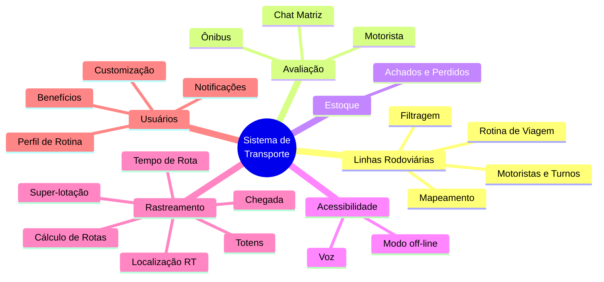
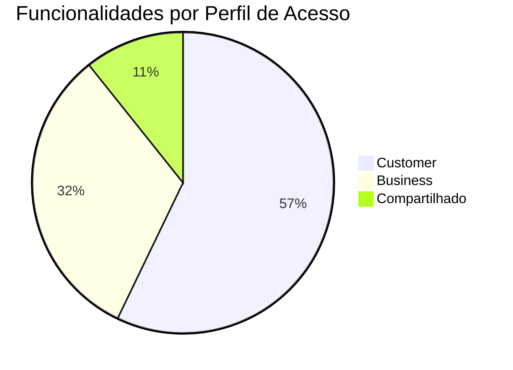
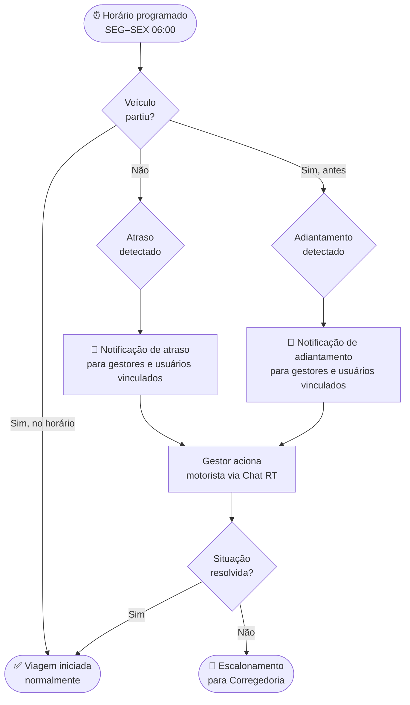
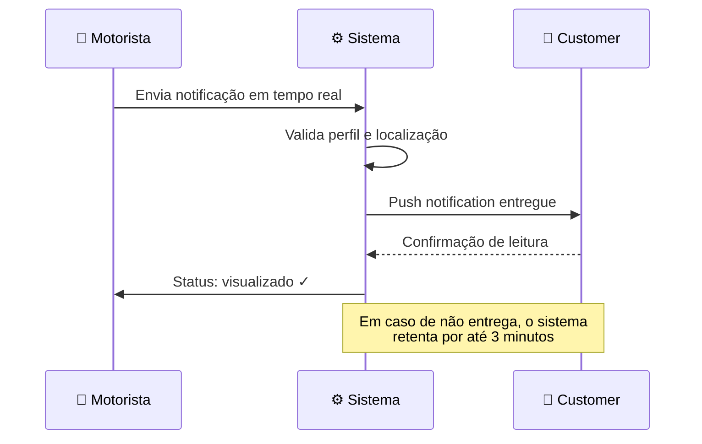
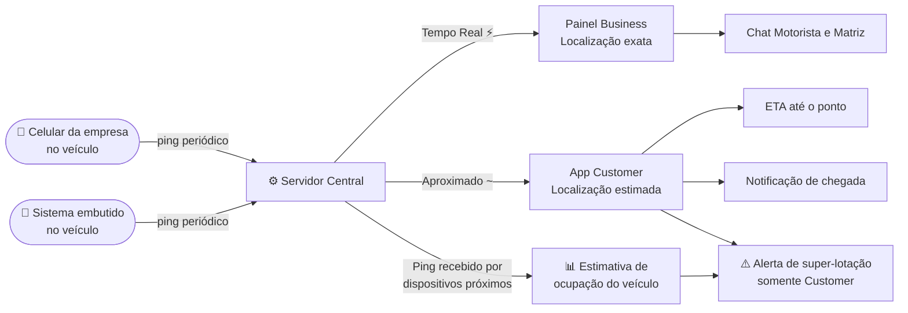
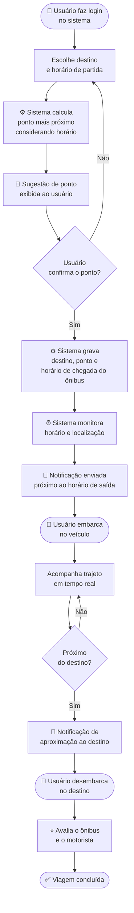
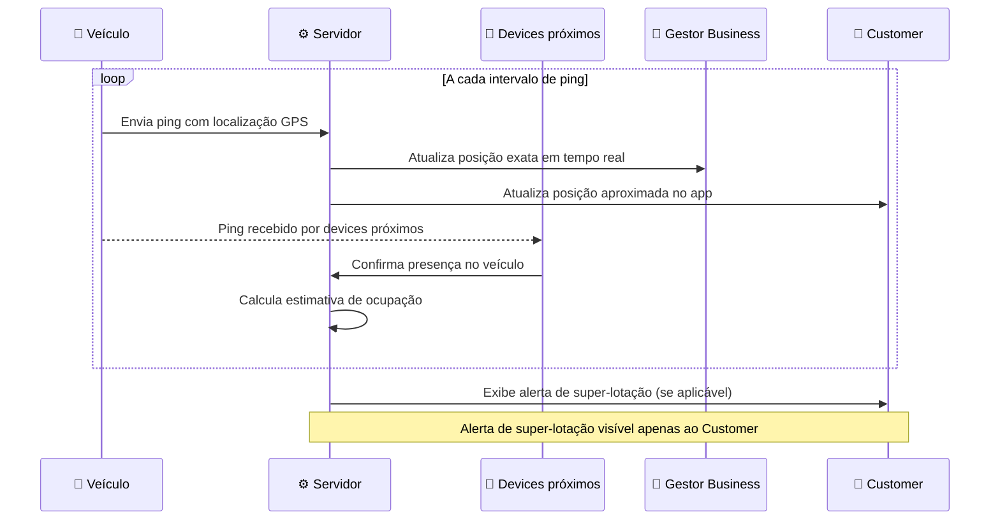
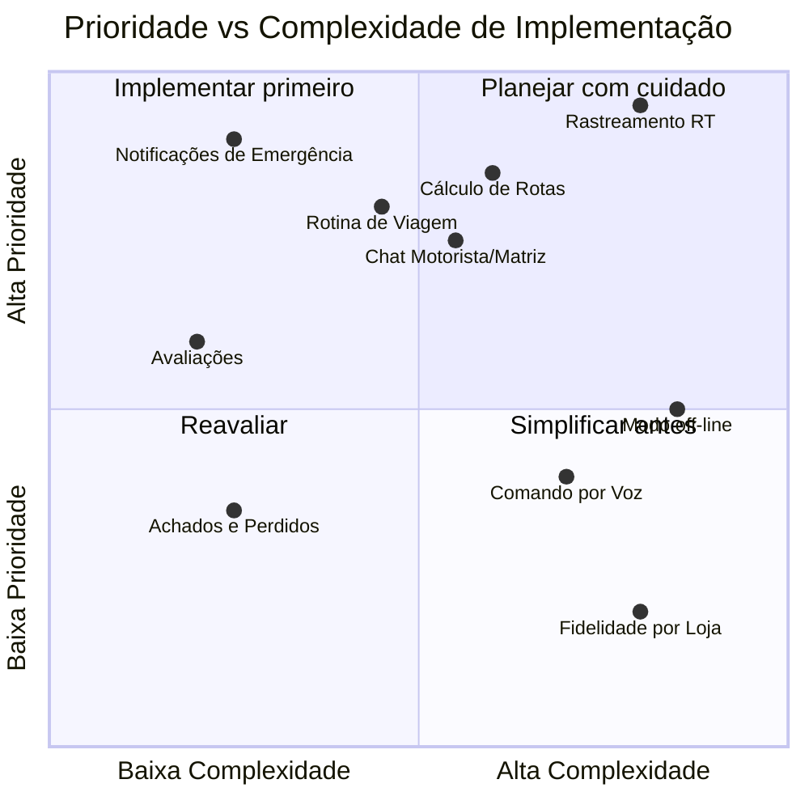

# 🚌 Rotas Inteligentes — Especificação de Funcionalidades

> **Versão:** 1.3.0  
> **Status:** Em Desenvolvimento  
> **Classificação:** Interno

---

## 📋 Sumário

1. [Visão Geral](https://claude.ai/chat/4f1a988c-3b52-43a1-95a8-9cfa2e542ecb#vis%C3%A3o-geral)
2. [Arquitetura de Módulos](https://claude.ai/chat/4f1a988c-3b52-43a1-95a8-9cfa2e542ecb#arquitetura-de-m%C3%B3dulos)
3. [Distribuição por Perfil](https://claude.ai/chat/4f1a988c-3b52-43a1-95a8-9cfa2e542ecb#distribui%C3%A7%C3%A3o-por-perfil)
4. [Módulos e Funcionalidades](https://claude.ai/chat/4f1a988c-3b52-43a1-95a8-9cfa2e542ecb#m%C3%B3dulos-e-funcionalidades)
    - [Linhas Rodoviárias](https://claude.ai/chat/4f1a988c-3b52-43a1-95a8-9cfa2e542ecb#1-linhas-rodovi%C3%A1rias)
    - [Avaliação](https://claude.ai/chat/4f1a988c-3b52-43a1-95a8-9cfa2e542ecb#2-avalia%C3%A7%C3%A3o)
    - [Estoque](https://claude.ai/chat/4f1a988c-3b52-43a1-95a8-9cfa2e542ecb#3-estoque)
    - [Acessibilidade](https://claude.ai/chat/4f1a988c-3b52-43a1-95a8-9cfa2e542ecb#4-acessibilidade)
    - [Rastreamento](https://claude.ai/chat/4f1a988c-3b52-43a1-95a8-9cfa2e542ecb#5-rastreamento)
    - [Usuários](https://claude.ai/chat/4f1a988c-3b52-43a1-95a8-9cfa2e542ecb#6-usu%C3%A1rios)
5. [Fluxos Críticos](https://claude.ai/chat/4f1a988c-3b52-43a1-95a8-9cfa2e542ecb#fluxos-cr%C3%ADticos)
6. [Matriz de Prioridades](https://claude.ai/chat/4f1a988c-3b52-43a1-95a8-9cfa2e542ecb#matriz-de-prioridades)
7. [Glossário](https://claude.ai/chat/4f1a988c-3b52-43a1-95a8-9cfa2e542ecb#gloss%C3%A1rio)

---

## Visão Geral

Este documento descreve as funcionalidades do sistema de transporte público, organizadas por módulo e perfil de acesso. O sistema atende dois perfis principais: **Business** (operadores e gestores) e **Customer** (passageiros e usuários finais).

### Resumo Executivo

|Indicador|Valor|
|---|---|
|Total de módulos|6|
|Total de funcionalidades|28|
|Funcionalidades Business|9|
|Funcionalidades Customer|16|
|Funcionalidades Compartilhadas|3|
|Funcionalidades que requerem conectividade em tempo real|4|

---

## Arquitetura de Módulos

---

## Distribuição por Perfil

---

## Módulos e Funcionalidades

### 1. Linhas Rodoviárias

> Gestão das rotas e operação das linhas de transporte. Envolve configuração de trajetos, motoristas e controle de pontualidade.

| Funcionalidade                         | Perfil     | Conectividade | Detalhes                                                          |
| -------------------------------------- | ---------- | ------------- | ----------------------------------------------------------------- |
| Mapeamento                             | `Customer` | Online        | Visualização de linhas no mapa                                    |
| Filtragem                              | `Customer` | Online        | Filtro por linha, região ou horário                               |
| Definição de motoristas e turnos       | `Business` | Offline       | Cadastro e escalonamento de equipe                                |
| Rotina de início de viagem             | `Business` | Online        | Agendamento recorrente SEG–SEX às 06:00                           |
| ↳ Início atrasado / adiantado          | `Business` | Online        | Detecção de desvio de horário                                     |
| ↳ Notificação de atraso / adiantamento | `Business` | Tempo Real ⚡  | Alerta automático para gestores **e usuários vinculados à linha** |

---

### 2. Avaliação

> Canal de feedback e supervisão da qualidade operacional. Permite que passageiros avaliem a experiência e que gestores monitorem a comunicação com motoristas.

|Funcionalidade|Perfil|Conectividade|Detalhes|
|---|---|---|---|
|Avaliação de Motorista|`Customer`|Online|Nota e comentário pós-viagem|
|Avaliação de Ônibus|`Customer`|Online|Avaliação de conservação e conforto|
|Chat em tempo real — motorista e matriz|`Business`|Tempo Real ⚡|Canal direto entre motorista e Corregedoria / Dono da empresa|

---

### 3. Estoque

> Controle de itens perdidos dentro dos veículos e terminais.

|Funcionalidade|Perfil|Conectividade|Detalhes|
|---|---|---|---|
|Achados e Perdidos|`Customer` / `Business`|Online|Registro e consulta de itens perdidos|

---

### 4. Acessibilidade

> Recursos que garantem o uso do sistema por diferentes perfis de usuário, incluindo suporte a voz e operação sem internet.

|Funcionalidade|Perfil|Conectividade|Detalhes|
|---|---|---|---|
|Comando rápido por voz|`Customer`|Offline|Acionamento de funções por voz|
|Modo off-line|`Customer`|Offline|Acesso a dados em cache sem conexão|

---

### 5. Rastreamento

> Núcleo operacional do sistema. Concentra as funcionalidades de localização, cálculo de rotas e monitoramento de capacidade em tempo real.

> **📡 Fonte de GPS:** A localização do veículo pode ser obtida por dois meios — um **celular da empresa** instalado no veículo, ou um **sistema de localização embutido** no próprio veículo. Ambos enviam pings periódicos ao servidor central.

> **🔔 Sistema de Totem (Pings):** O Totem não é um painel físico isolado — é um sistema de pings enviados pelo veículo ao servidor. Esses pings também são recebidos pelos dispositivos de usuários próximos ao veículo, confirmando a presença do passageiro a bordo e fornecendo uma contagem aproximada de ocupantes.

|Funcionalidade|Perfil|Conectividade|Detalhes|
|---|---|---|---|
|Totem — localização do ônibus|`Customer` / `Business`|Tempo Real ⚡|Pings do veículo ao servidor; posição exibida no app e em painéis nos pontos|
|Totem — confirmação de passageiros a bordo|`Customer` / `Business`|Tempo Real ⚡|Pings recebidos pelos devices próximos confirmam presença; estima ocupação do veículo|
|Cálculo de rotas|`Customer` / `Business`|Online|Melhor rota entre origem e destino|
|↳ Previsão de tempo por geolocalização|`Customer`|Online|ETA com base na posição atual|
|Identificação de super-lotação|`Customer`|Online|Alerta de capacidade excedida — **visível apenas ao Customer**|
|Identificação de chegada|`Customer`|Online|Notificação ao aproximar do ponto|
|Acompanhamento de tempo de rota|`Customer`|Online|Progresso da viagem em andamento|
|Localização em tempo real do veículo ⚡|`Business`|Tempo Real ⚡|GPS ao vivo via celular da empresa ou sistema embutido no veículo|
|Rastreamento aproximado* do veículo e pontos|`Customer`|Online|Posição estimada para passageiros|
|Tempo aproximado de chegada ao ponto|`Customer`|Online|ETA ao ponto de embarque do usuário|

---

### 6. Usuários

> Personalização da experiência, programa de benefícios e comunicação proativa com o passageiro.

|Funcionalidade|Perfil|Conectividade|Detalhes|
|---|---|---|---|
|Benefícios — Fidelidade|`Customer`|Online|Pontos acumulados por viagem|
|Benefícios — Fidelidade por loja|`Customer`|Online|Pontos e descontos em parceiros comerciais|
|Notificações de emergência|`Customer`|Tempo Real ⚡|Alertas críticos de segurança e operação|
|Perfil de rotina do usuário|`Customer`|Online|Aprendizado de rotas e horários frequentes|
|Sistema customizável por companhia|`Business`|Offline|White-label e configurações por operadora|
|Envio de notificações para aluno / customer|`Business`|Tempo Real ⚡|Ex.: _"Só falta você. O veículo está te esperando..."_|
|Notificação em tempo real enviada pelo motorista|`Customer`|Tempo Real ⚡|Mensagens diretas do motorista ao passageiro|

---

## Fluxos Críticos

### Fluxo de Rotina de Viagem com Desvio de Horário

---

### Fluxo de Notificação ao Passageiro

---

### Fluxo de Rastreamento por Perfil

---

### Fluxo de Jornada do Usuário (Customer)

---

### Fluxo do Sistema de Totem — Pings e Ocupação

---

---

## Glossário

| Termo           | Definição                                                                                                                                                                                                |
| --------------- | -------------------------------------------------------------------------------------------------------------------------------------------------------------------------------------------------------- |
| `Business`      | Perfil destinado à gestão e operação da empresa de transporte (gestores, corregedoria, donos de empresa)                                                                                                 |
| `Customer`      | Perfil destinado ao passageiro ou usuário final do aplicativo                                                                                                                                            |
| `Compartilhado` | Funcionalidade acessível por ambos os perfis com diferentes níveis de permissão                                                                                                                          |
| ⚡ Tempo Real    | Requer conexão ativa e transmissão contínua de dados (GPS, WebSocket ou similar)                                                                                                                         |
| `*` Aproximado  | Dado calculado com margem de estimativa; não requer precisão de GPS em tempo real                                                                                                                        |
| ETA             | _Estimated Time of Arrival_ — tempo estimado de chegada                                                                                                                                                  |
| RT              | Tempo Real (_Real Time_)                                                                                                                                                                                 |
| Corregedoria    | Órgão interno de fiscalização e supervisão dos motoristas                                                                                                                                                |
| Totem           | Sistema de pings enviados pelo veículo ao servidor para rastrear localização. Os pings também são recebidos pelos dispositivos de usuários próximos, confirmando presença a bordo e estimando a ocupação |
| White-label     | Sistema configurável com a identidade visual e regras da operadora parceira                                                                                                                              |

---

> 📌 **Nota de conectividade:** Funcionalidades marcadas com ⚡ exigem infraestrutura de rede estável. Recomenda-se análise de cobertura de sinal nas rotas antes da implantação dessas features.